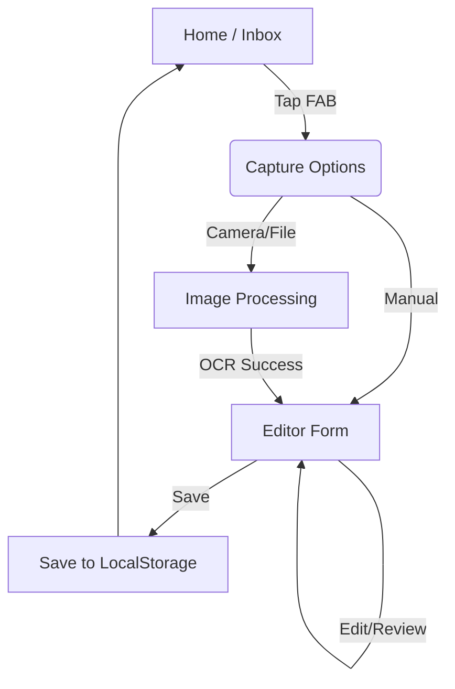
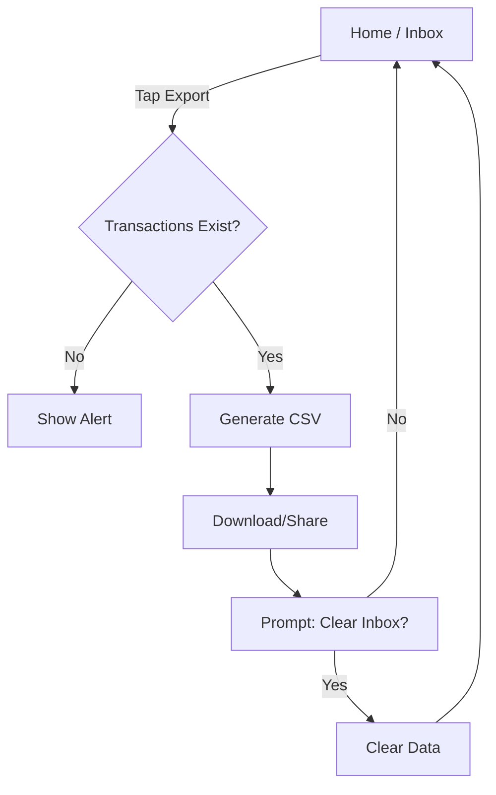

# Design Overhaul: HB Go V2

This document outlines the complete UI/UX overhaul for **HB Go**, creating a modern, minimalist, and accessible Progressive Web Application.

## 1. Design Philosophy

*   **Minimalist & Clean:** Reduce visual clutter. Focus on the content (transactions). Use whitespace effectively.
*   **Mobile-First:** The primary use case is on a mobile device while on the go. Touch targets must be large (min 44px).
*   **Accessible:** WCAG 2.1 AA Compliance. High contrast, clear focus states, screen reader support.
*   **Instant Feedback:** Every action (save, delete, upload) has immediate visual feedback.

## 2. Color Palette

We will use a refined color palette leveraging Tailwind's default colors but restricted to a specific set to ensure consistency.

### Primary (Brand)
*   **Indigo-600** (`#4f46e5`): Primary buttons, active states, key highlights.
*   **Indigo-50** (`#eef2ff`): Subtle backgrounds for active items.

### Neutral (Surface & Text)
*   **Slate-900** (`#0f172a`): Main headings, primary text.
*   **Slate-600** (`#475569`): Secondary text, icons.
*   **Slate-100** (`#f1f5f9`): Page background (off-white).
*   **White** (`#ffffff`): Card backgrounds, modals.

### Semantic
*   **Emerald-600** (`#059669`): Success messages, positive values.
*   **Rose-600** (`#e11d48`): Error messages, destructive actions (delete).
*   **Amber-500** (`#f59e0b`): Warning states.

## 3. Typography

*   **Font Family:** `Inter` (sans-serif). It is highly legible on screens and has excellent variable weight support.
*   **Scale:**
    *   **Heading 1:** `text-2xl font-bold` (Page Titles)
    *   **Heading 2:** `text-lg font-semibold` (Section Headers)
    *   **Body:** `text-base` (Inputs, Main text)
    *   **Caption:** `text-sm text-slate-500` (Helper text, Metadata)

## 4. Iconography

We will migrate from Emojis to **Lucide React** icons for a professional look.
*   Camera -> `Camera`
*   Settings -> `Settings`
*   Export -> `Download`
*   Delete -> `Trash2`
*   Edit -> `Edit3`
*   Back -> `ChevronLeft`

## 5. User Flows

### 5.1 Capture & Edit Flow (The Core Loop)

### 5.2 Export Flow

## 6. Layout & Mockups

### 6.1 Home (Inbox)
*   **Header:** Simple "HB Go" logo left, "Settings" icon right.
*   **Summary Card:** A prominent card at the top showing "Total Pending" with a big number.
    *   *Action:* "Export CSV" button inside this card (Primary).
*   **Transaction List:**
    *   Swipe-able list items (if possible, otherwise simple cards).
    *   Each item shows: Payee (Bold), Date (Small), Amount (Right aligned, Bold).
    *   Clicking an item opens the Editor.
*   **FAB (Floating Action Button):** Fixed bottom-right. Large Indigo circle with a Camera icon.

### 6.2 Editor (Capture/Edit)
*   **Layout:**
    *   **Mobile:** Stacked. Image preview at the top (collapsible), Form below.
    *   **Desktop:** Split view. Image on Left (sticky), Form on Right.
*   **Form:**
    *   Floating label inputs (Material style or standard labeled inputs with good spacing).
    *   **Smart Suggestions:** Autocomplete for Payee and Category based on history.
    *   **OCR Feedback:** A subtle progress bar or toast notification instead of blocking the UI if possible (though blocking is safer for data integrity).
*   **Actions:** Sticky bottom bar on mobile with "Cancel" (Secondary) and "Save" (Primary).

### 6.3 Settings
*   **Grouped Lists:** "Data Management", "Preferences", "About".
*   **Import:** clear drag-and-drop zone or large button for `.xhb` import.
*   **Destructive Actions:** "Clear Data" at the bottom, in red, requiring confirmation.

## 7. Component Architecture

We will build reusable components to ensure consistency.

*   `Button`: Variants (Primary, Secondary, Ghost, Destructive).
*   `Input`: Standard text input with error state support.
*   `Select`: For categories (potentially a combobox for searchability).
*   `Card`: White background, rounded-lg, shadow-sm.
*   `IconButton`: For navigation and actions.
*   `Modal`: For confirmations.
*   `LoadingOverlay`: For OCR processing.

## 8. Accessibility & Performance

### Accessibility
*   **Focus Management:** Ensure focus returns to logical places after closing modals.
*   **ARIA Labels:** All icon-only buttons must have `aria-label`.
*   **Semantic HTML:** Use `<header>`, `<main>`, `<footer>`, `<article>`, `<button>` properly.
*   **Keyboard Nav:** Ensure the entire app is navigable via Tab/Enter/Space.

### Performance
*   **Code Splitting:** Lazy load routes (already done mostly via Vite/React).
*   **Image Optimization:** Resize images before storing them in IndexedDB to prevent quota issues.
*   **Font Loading:** Use `font-display: swap`.
*   **Memoization:** Use `useMemo` for expensive list filtering/sorting.

## 9. Implementation Plan (Phase 5)

1.  **Setup:** Install `lucide-react`, configure Tailwind colors/fonts.
2.  **Components:** Build the core UI library (`src/components/ui/`).
3.  **Refactor Home:** Rewrite `Home.jsx` using new components.
4.  **Refactor Editor:** Rewrite `Editor.jsx` implementing the split view and improved form.
5.  **Refactor Settings:** Rewrite `Settings.jsx` with grouped sections.
6.  **Review:** Audit against WCAG guidelines.
